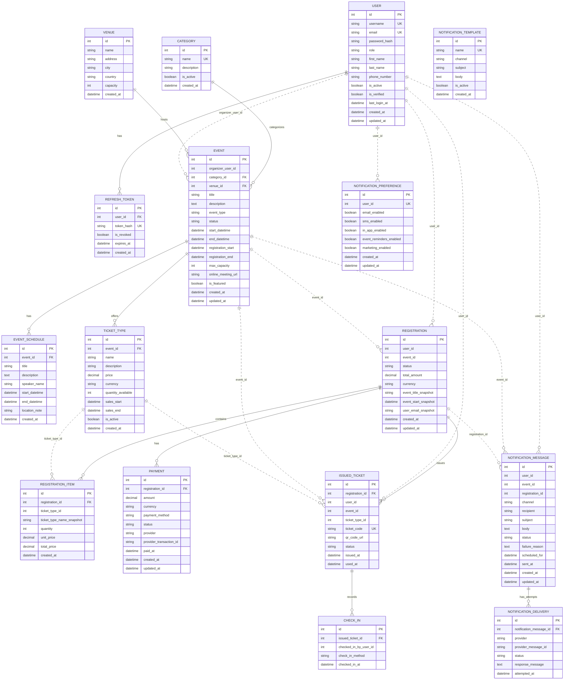

```mermaid
erDiagram

    %% =========================
    %% USER SERVICE DATABASE
    %% =========================

    USER {
        int id PK
        string username UK
        string email UK
        string password_hash
        string role
        string first_name
        string last_name
        string phone_number
        boolean is_active
        boolean is_verified
        datetime last_login_at
        datetime created_at
        datetime updated_at
    }

    REFRESH_TOKEN {
        int id PK
        int user_id FK
        string token_hash UK
        boolean is_revoked
        datetime expires_at
        datetime created_at
    }

    USER ||--o{ REFRESH_TOKEN : has


    %% =========================
    %% EVENT SERVICE DATABASE
    %% =========================

    CATEGORY {
        int id PK
        string name UK
        string description
        boolean is_active
        datetime created_at
    }

    VENUE {
        int id PK
        string name
        string address
        string city
        string country
        int capacity
        datetime created_at
    }

    EVENT {
        int id PK
        int organizer_user_id
        int category_id FK
        int venue_id FK
        string title
        text description
        string event_type
        string status
        datetime start_datetime
        datetime end_datetime
        datetime registration_start
        datetime registration_end
        int max_capacity
        string online_meeting_url
        boolean is_featured
        datetime created_at
        datetime updated_at
    }

    EVENT_SCHEDULE {
        int id PK
        int event_id FK
        string title
        text description
        string speaker_name
        datetime start_datetime
        datetime end_datetime
        string location_note
        datetime created_at
    }

    TICKET_TYPE {
        int id PK
        int event_id FK
        string name
        string description
        decimal price
        string currency
        int quantity_available
        datetime sales_start
        datetime sales_end
        boolean is_active
        datetime created_at
    }

    CATEGORY ||--o{ EVENT : categorizes
    VENUE ||--o{ EVENT : hosts
    EVENT ||--o{ EVENT_SCHEDULE : has
    EVENT ||--o{ TICKET_TYPE : offers


    %% =========================
    %% EVENT REGISTRATION SERVICE DATABASE
    %% =========================

    REGISTRATION {
        int id PK
        int user_id
        int event_id
        string status
        decimal total_amount
        string currency
        string event_title_snapshot
        datetime event_start_snapshot
        string user_email_snapshot
        datetime created_at
        datetime updated_at
    }

    REGISTRATION_ITEM {
        int id PK
        int registration_id FK
        int ticket_type_id
        string ticket_type_name_snapshot
        int quantity
        decimal unit_price
        decimal total_price
        datetime created_at
    }

    PAYMENT {
        int id PK
        int registration_id FK
        decimal amount
        string currency
        string payment_method
        string status
        string provider
        string provider_transaction_id
        datetime paid_at
        datetime created_at
        datetime updated_at
    }

    ISSUED_TICKET {
        int id PK
        int registration_id FK
        int user_id
        int event_id
        int ticket_type_id
        string ticket_code UK
        string qr_code_url
        string status
        datetime issued_at
        datetime used_at
    }

    CHECK_IN {
        int id PK
        int issued_ticket_id FK
        int checked_in_by_user_id
        string check_in_method
        datetime checked_in_at
    }

    REGISTRATION ||--o{ REGISTRATION_ITEM : contains
    REGISTRATION ||--o{ PAYMENT : has
    REGISTRATION ||--o{ ISSUED_TICKET : issues
    ISSUED_TICKET ||--o{ CHECK_IN : records


    %% =========================
    %% NOTIFICATION SERVICE DATABASE
    %% =========================

    NOTIFICATION_TEMPLATE {
        int id PK
        string name UK
        string channel
        string subject
        text body
        boolean is_active
        datetime created_at
    }

    NOTIFICATION_PREFERENCE {
        int id PK
        int user_id UK
        boolean email_enabled
        boolean sms_enabled
        boolean in_app_enabled
        boolean event_reminders_enabled
        boolean marketing_enabled
        datetime created_at
        datetime updated_at
    }

    NOTIFICATION_MESSAGE {
        int id PK
        int user_id
        int event_id
        int registration_id
        string channel
        string recipient
        string subject
        text body
        string status
        text failure_reason
        datetime scheduled_for
        datetime sent_at
        datetime created_at
        datetime updated_at
    }

    NOTIFICATION_DELIVERY {
        int id PK
        int notification_message_id FK
        string provider
        string provider_message_id
        string status
        text response_message
        datetime attempted_at
    }

    NOTIFICATION_MESSAGE ||--o{ NOTIFICATION_DELIVERY : has_attempts


    %% =========================
    %% CROSS-SERVICE REFERENCES
    %% DOTTED = REFERENCE ONLY, NOT REAL FOREIGN KEY
    %% =========================

    USER ||..o{ EVENT : organizer_user_id
    USER ||..o{ REGISTRATION : user_id
    USER ||..o{ ISSUED_TICKET : user_id
    USER ||..o{ NOTIFICATION_PREFERENCE : user_id
    USER ||..o{ NOTIFICATION_MESSAGE : user_id

    EVENT ||..o{ REGISTRATION : event_id
    EVENT ||..o{ ISSUED_TICKET : event_id
    EVENT ||..o{ NOTIFICATION_MESSAGE : event_id

    TICKET_TYPE ||..o{ REGISTRATION_ITEM : ticket_type_id
    TICKET_TYPE ||..o{ ISSUED_TICKET : ticket_type_id

    REGISTRATION ||..o{ NOTIFICATION_MESSAGE : registration_id
```