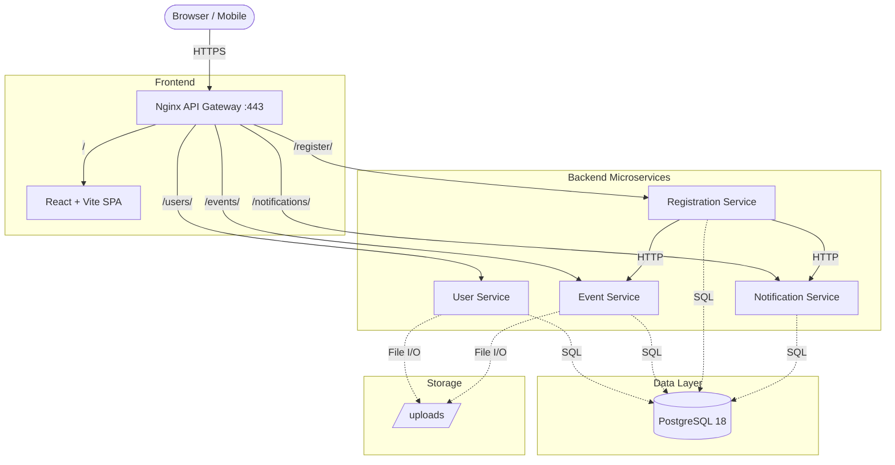

# Evora — Cloud-Native Event Management Platform

## Project Overview

Evora is a **microservices-based event management platform** built with **FastAPI**, **React**, **PostgreSQL**, and **Docker**. It provides a full-stack solution for discovering, organizing, and registering for events — complete with user authentication, role-based access, image uploads, notifications, and a production-grade deployment pipeline.

### Architecture Diagram



---

## Technology Stack

| Layer | Technology |
|-------|-----------|
| **Frontend** | React 18, Vite 5, TailwindCSS, Framer Motion, Lucide Icons |
| **Backend** | FastAPI (Python 3.13+), Uvicorn, Pydantic v2 |
| **Database** | PostgreSQL 18, SQLAlchemy 2.0 ORM, Alembic Migrations |
| **Auth** | JWT (PyJWT HS256), Stateless cross-service verification |
| **API Gateway** | Nginx (SSL/TLS, Gzip, Reverse Proxy) |
| **Containerization** | Docker, Docker Compose (Dev / Test / Prod) |
| **Testing** | Pytest, HTTPX (async test client) |

---

## Project Structure

```
cloud-project/
├── docker-compose.dev.yml          # Development (hot-reload, exposed ports)
├── docker-compose.test.yml         # Automated test suite (51 tests)
├── docker-compose.prod.yml         # Production (optimized, no exposed ports)
├── nginx/                          # API Gateway config + SSL certs
│   ├── nginx.conf
│   └── ssl/
├── frontend/                       # React SPA (Vite)
│   ├── Dockerfile                  # Dev image (node:20-alpine)
│   ├── Dockerfile.prod             # Multi-stage prod (build → nginx:alpine)
│   └── src/
│       ├── pages/                  # Landing, Discover, Profile, Organizer, etc.
│       └── components/             # EventCard, EventForm, Navbar, etc.
├── user-service/                   # User management & authentication
├── event-service/                  # Event CRUD & search
├── event-registration-service/     # Ticket booking & capacity management
├── notification-service/           # In-app notifications & email logging
├── docs/                           # Architecture diagrams & DB schemas
└── k8s/                            # Kubernetes deployment manifests
```

---

## Quick Start

### Prerequisites
- Docker & Docker Compose v2+
- Git
- (Optional) Node.js 20+ for local frontend development

### Development Environment
```bash
# Clone and navigate
cd /path/to/cloud-project

# Start everything (7 containers)
docker compose -f docker-compose.dev.yml up -d

# Access the platform
# Frontend:   https://evora.com  (add 127.0.0.1 evora.com to /etc/hosts)
# User API:   http://localhost:8000/docs
# Event API:  http://localhost:8001/docs
```

### Run Automated Tests (51 tests)
```bash
docker compose -f docker-compose.test.yml up --build --abort-on-container-exit
```

### Production Deployment
```bash
# Set environment variables
export SECRET_KEY=your_production_secret_key
export POSTGRES_PASSWORD=strong_db_password

# Build and launch
docker compose -f docker-compose.prod.yml up -d --build

# Apply database migrations
docker exec -w /app evora-user-service-prod alembic upgrade head
docker exec -w /app evora-event-service-prod alembic upgrade head
docker exec -w /app evora-event-registration-service-prod alembic upgrade head
docker exec -w /app evora-notification-service-prod alembic upgrade head
```

---

## Services Overview

| Service | Port (Dev) | Endpoints | Description |
|---------|-----------|-----------|-------------|
| **User Service** | 8000 | `/users/` | Registration, login, JWT auth, profile, role management, avatar upload |
| **Event Service** | 8001 | `/events/` | Event CRUD, search (category/location/price/organizer), background image upload |
| **Registration Service** | 8002 | `/register/` | Ticket booking, capacity enforcement, booking history |
| **Notification Service** | 8003 | `/notifications/` | Send/list notifications, unread count, mark-as-read |
| **Frontend** | 3000 | `/` | React SPA served through Nginx |
| **Nginx Gateway** | 80/443 | — | SSL termination, reverse proxy, gzip, static file caching |
| **PostgreSQL** | 5432 | — | Shared database (`evoradb`) with isolated Alembic migrations per service |

---

## Docker Compose Environments

| File | Purpose | DB | Ports Exposed |
|------|---------|----|----|
| `docker-compose.dev.yml` | Local development with hot-reload | `evoradb` on :5432 | All services + DB |
| `docker-compose.test.yml` | CI/CD test runner (51 automated tests) | `evoradb_test` on :5433 | Test DB only |
| `docker-compose.prod.yml` | Production deployment | `evoradb` (internal only) | 80, 443 only |

---

## Image Upload System

Both event background images and user profile avatars are supported:

| Feature | Endpoint | Max Size | Formats | Storage Path |
|---------|----------|----------|---------|-------------|
| Event Image | `POST /events/{id}/image` | 2 MB | JPEG, PNG, WebP, GIF | `/app/uploads/events/` |
| Profile Avatar | `POST /users/me/image` | 2 MB | JPEG, PNG, WebP, GIF | `/app/uploads/profiles/` |

Images are served as static files through FastAPI's `StaticFiles` mount and accessible via Nginx at:
- Event: `https://evora.com/events/static/uploads/events/{filename}`
- Profile: `https://evora.com/users/static/uploads/profiles/{filename}`

---

## Automated Test Suite

**51 tests** across 3 services, all running against an isolated test database:

| Service | Tests | Coverage |
|---------|-------|----------|
| **User Service** | 19 | Registration, login, profile CRUD, role upgrades, duplicates, validation |
| **Event Service** | 20 | CRUD, search (4 filters), authorization, date validation, ownership |
| **Notification Service** | 12 | Send, list, unread count, mark-as-read, auth, impersonation guard |

```bash
# Run all tests
docker compose -f docker-compose.test.yml up --build --abort-on-container-exit

# Run single service tests
docker compose -f docker-compose.test.yml up --build user-service-test
```

---

## Common Commands

```bash
# Development
docker compose -f docker-compose.dev.yml up -d             # Start all
docker compose -f docker-compose.dev.yml logs -f [service]  # View logs
docker compose -f docker-compose.dev.yml restart [service]  # Restart

# Database
docker exec -it evora-db psql -U db_admin -d evoradb       # Connect to DB
docker exec -w /app evora-event-service alembic upgrade head # Apply migrations

# Testing
docker compose -f docker-compose.test.yml up --build --abort-on-container-exit

# Production
docker compose -f docker-compose.prod.yml up -d --build
docker compose -f docker-compose.prod.yml down
```

---

## Environment Variables

| Variable | Required | Default | Description |
|----------|----------|---------|-------------|
| `DATABASE_URL` | Yes | — | PostgreSQL connection string |
| `SECRET_KEY` | Yes | `change_me_in_production` | JWT signing key (must match across services) |
| `POSTGRES_USER` | Prod | `db_admin` | Database username |
| `POSTGRES_PASSWORD` | Prod | `evora123` | Database password |
| `POSTGRES_DB` | Prod | `evoradb` | Database name |

> **Critical**: `SECRET_KEY` must be identical across all backend services for JWT verification to work.

---

## Service Documentation

Each microservice has its own detailed README:

- **[User Service](./user-service/README.md)** — Auth, profiles, roles, avatar uploads
- **[Event Service](./event-service/README.md)** — CRUD, search, image uploads
- **[Registration Service](./event-registration-service/README.md)** — Ticketing & capacity
- **[Notification Service](./notification-service/README.md)** — Alerts & email logging

Architecture details:

- **[Architecture & Sequence Diagrams](./docs/architecture.md)**
- **[Database ER Diagram](./docs/database.md)**
- **[Kubernetes Deployment Guide](./docs/kubernetes.md)**

---

## Troubleshooting

### Services not starting
```bash
docker compose -f docker-compose.dev.yml logs [service]    # Check logs
docker ps -a                                                 # Check container status
```

### Database tables missing
```bash
docker exec -w /app evora-event-service alembic upgrade head
docker exec -w /app evora-user-service alembic upgrade head
```

### Image uploads returning 404
- Ensure nginx was reloaded: `docker exec evora-nginx nginx -s reload`
- Verify file exists: `docker exec evora-event-service ls /app/uploads/events/`

### Port conflicts
```bash
lsof -i :8000                   # Find what's using the port
docker compose down              # Stop all containers
```

---

## Project Roadmap

| Phase | Status | Deliverable |
|-------|--------|-------------|
| Phase 1 | ✅ Complete | User Service (auth, JWT, roles) |
| Phase 2 | ✅ Complete | Event Service (CRUD, search, images) |
| Phase 3 | ✅ Complete | Registration Service (ticketing, capacity) |
| Phase 4 | ✅ Complete | Notification Service (alerts, email) |
| Phase 5 | ✅ Complete | Nginx Gateway (SSL, gzip, proxy) |
| Phase 6 | ✅ Complete | React Frontend (SPA, 10+ pages) |
| Phase 7 | ✅ Complete | Automated Testing (51 tests) |
| Phase 8 | ✅ Complete | Production Deployment Pipeline |
| Phase 9 | ✅ Complete | Image Upload System (events + profiles) |
| Phase 10 | 📋 Ready | Kubernetes Deployment Manifests |

---

**Last Updated**: May 12, 2026
