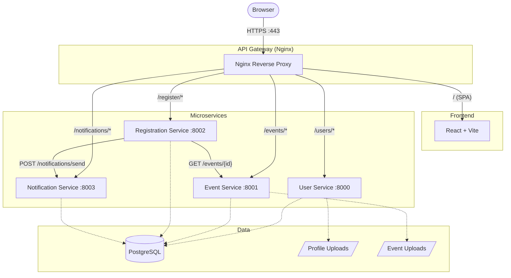
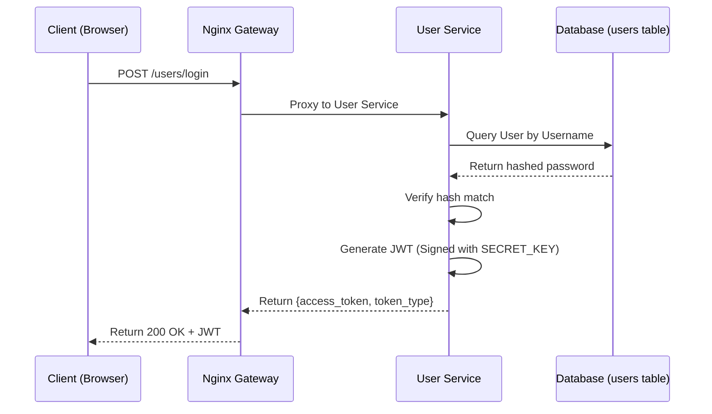
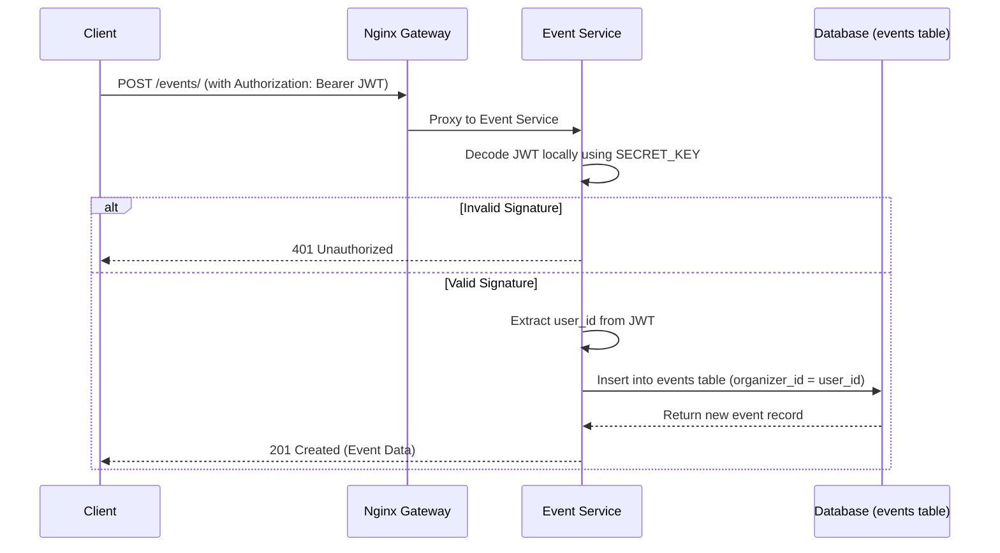
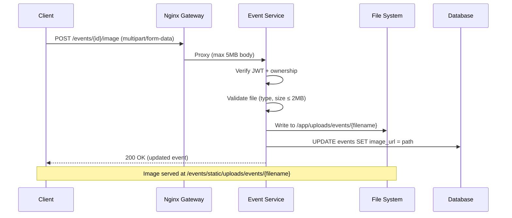
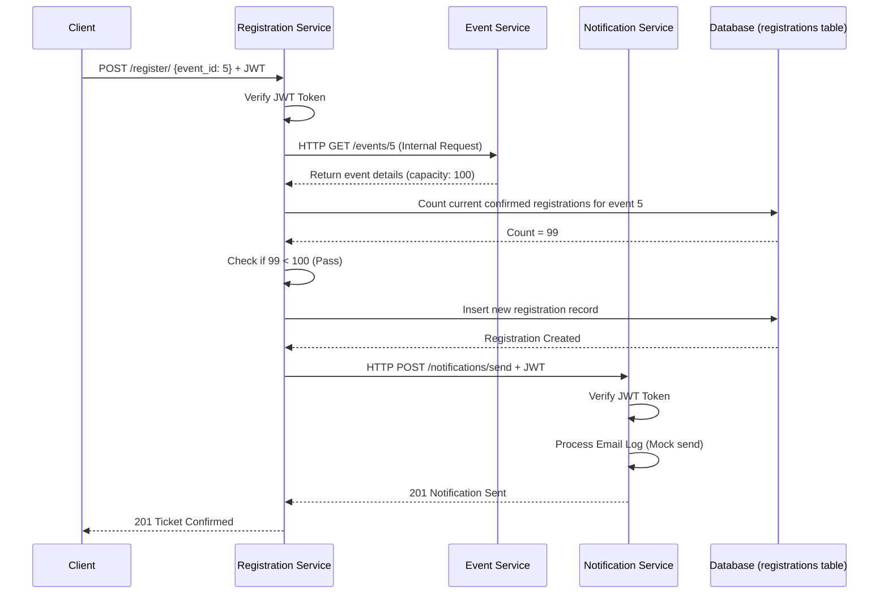

# Evora Architecture & Tech Stack

## Complete Tech Stack

### Frontend
*   **Framework**: React 18 with Vite 5
*   **Styling**: TailwindCSS 3
*   **Animation**: Framer Motion
*   **Icons**: Lucide React
*   **HTTP Client**: Axios (with interceptors for JWT)
*   **Routing**: React Router v6
*   **Notifications**: React Hot Toast

### Backend Services
*   **Framework**: FastAPI (Python 3.13+)
*   **Application Server**: Uvicorn (ASGI)
*   **Data Validation**: Pydantic v2
*   **Authentication**: PyJWT (HS256 stateless tokens)
*   **HTTP Client**: HTTPX (for synchronous inter-service calls)
*   **Password Hashing**: Passlib (pbkdf2_sha256)
*   **File Uploads**: python-multipart + FastAPI StaticFiles

### Database Layer
*   **RDBMS**: PostgreSQL 18
*   **ORM**: SQLAlchemy 2.0
*   **Migrations**: Alembic (isolated `version_table` per service for safe shared-DB usage)

### Infrastructure & Operations
*   **Containerization**: Docker (multi-stage builds for production)
*   **Orchestration**: Docker Compose (Dev, Test, Prod)
*   **Reverse Proxy / API Gateway**: Nginx (SSL, gzip, static caching)
*   **SSL/TLS**: OpenSSL (self-signed for development)
*   **Testing**: Pytest + HTTPX TestClient (51 automated tests)

---

## System Architecture

---

## Detailed Sequence Diagrams

### 1. User Registration & Login Flow

### 2. Event Creation & Security Flow

### 3. Event Image Upload Flow

### 4. Ticket Booking & Notification Flow

---

## Nginx Routing Table

| Path | Backend | Strip Prefix | Notes |
|------|---------|-------------|-------|
| `/` | `frontend:3000` | No | SPA with WebSocket for Vite HMR |
| `/users/` | `user-service:8000` | Yes (`/users/me` → `/me`) | Includes static profile uploads |
| `/events/` | `event-service:8000` | Yes | Includes static event uploads |
| `/register/` | `registration-service:8000` | Yes | |
| `/notifications/` | `notification-service:8000` | Yes | |

---

## Shared Database Strategy

All four microservices share a single PostgreSQL instance (`evoradb`) but use isolated Alembic migration tracking:

| Service | Tables Owned | Alembic Version Table |
|---------|-------------|----------------------|
| User Service | `users` | `alembic_version` |
| Event Service | `events` | `event_alembic_version` |
| Registration Service | `registrations` | `registration_alembic_version` |
| Notification Service | `notifications` | `notification_alembic_version` |

> **Important**: When running `alembic autogenerate`, each service only detects changes to its own models. Cross-service table drops are prevented by isolated version tables.

---

## Security Model

| Aspect | Implementation |
|--------|---------------|
| **Authentication** | JWT (HS256) with shared SECRET_KEY |
| **Authorization** | Role-based (user, organizer, admin) |
| **Password Storage** | pbkdf2_sha256 (one-way hash) |
| **CORS** | Configured per-service |
| **SSL/TLS** | Nginx terminates HTTPS (self-signed dev, real certs for prod) |
| **File Upload Validation** | Type checking + 2MB size limit |
| **Ownership Checks** | Event modifications require `organizer_id == jwt.id` or admin role |
