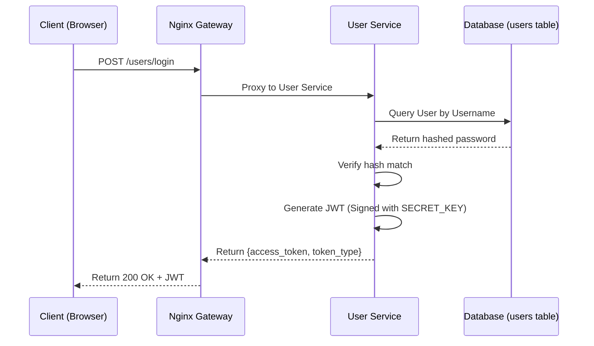
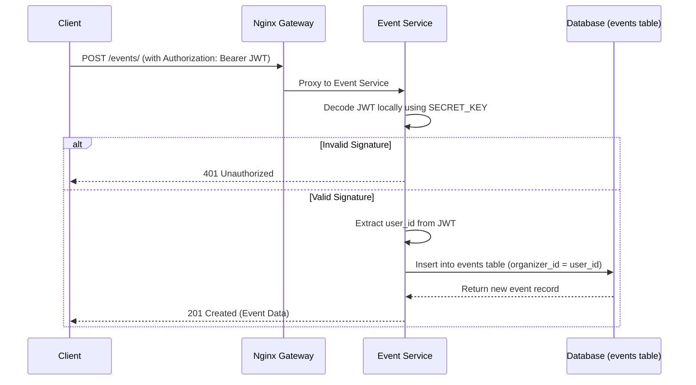
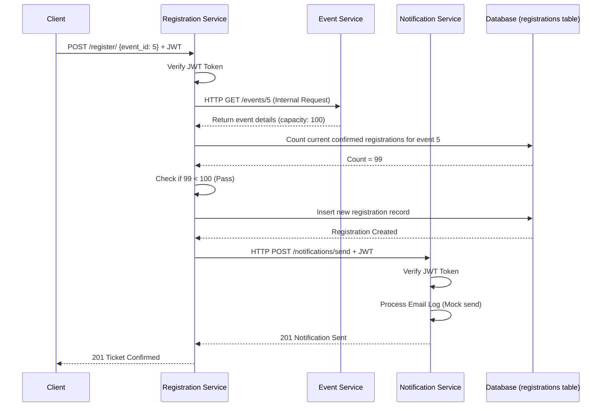

# Evora Architecture & Tech Stack

## Complete Tech Stack
### Backend Services
*   **Framework**: FastAPI (Python 3.13+)
*   **Application Server**: Uvicorn
*   **Data Validation**: Pydantic v2
*   **Authentication**: PyJWT (HS256)
*   **HTTP Client**: HTTPX (for synchronous internal inter-service calls)
*   **Password Hashing**: Passlib (pbkdf2_sha256)

### Database Layer
*   **RDBMS**: PostgreSQL 18
*   **ORM**: SQLAlchemy 2.0
*   **Migrations**: Alembic (Isolated via custom `version_table` and `include_name` filters per microservice to allow multiple services to share the same physical database instance securely)

### Infrastructure & Operations
*   **Containerization**: Docker
*   **Orchestration**: Docker Compose (Dev, Test, Prod variations)
*   **Reverse Proxy / API Gateway**: Nginx
*   **SSL/TLS**: OpenSSL (Self-signed for Dev)

---

## Detailed Sequence Diagrams

### 1. User Registration & Login Flow

### 2. Event Creation & Security Flow

### 3. Ticket Booking & Notification Flow (Complex Intersection)

