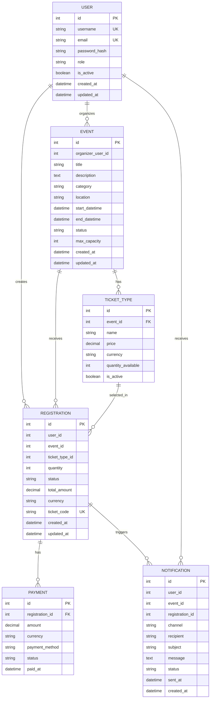

```mermaid
erDiagram

    USER {
        int id PK
        string username UK
        string email UK
        string password_hash
        string role
        boolean is_active
        datetime created_at
        datetime updated_at
    }

    EVENT {
        int id PK
        int organizer_user_id
        string title
        text description
        string category
        string location
        datetime start_datetime
        datetime end_datetime
        string status
        int max_capacity
        datetime created_at
        datetime updated_at
    }

    TICKET_TYPE {
        int id PK
        int event_id FK
        string name
        decimal price
        string currency
        int quantity_available
        boolean is_active
    }

    REGISTRATION {
        int id PK
        int user_id
        int event_id
        int ticket_type_id
        int quantity
        string status
        decimal total_amount
        string currency
        string ticket_code UK
        datetime created_at
        datetime updated_at
    }

    PAYMENT {
        int id PK
        int registration_id FK
        decimal amount
        string currency
        string payment_method
        string status
        datetime paid_at
    }

    NOTIFICATION {
        int id PK
        int user_id
        int event_id
        int registration_id
        string channel
        string recipient
        string subject
        text message
        string status
        datetime sent_at
        datetime created_at
    }

    EVENT ||--o{ TICKET_TYPE : has
    REGISTRATION ||--o{ PAYMENT : has

    USER ||--o{ EVENT : organizes
    USER ||--o{ REGISTRATION : creates
    EVENT ||--o{ REGISTRATION : receives
    TICKET_TYPE ||--o{ REGISTRATION : selected_in
    REGISTRATION ||--o{ NOTIFICATION : triggers
    USER ||--o{ NOTIFICATION : receives
```