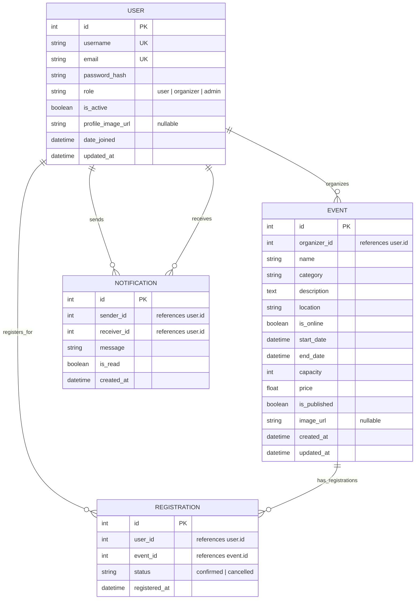

# Evora — Database Schema (Implemented)

This diagram shows the **actual implemented** database tables currently deployed in the shared PostgreSQL instance (`evoradb`).

## Table Ownership

Each microservice exclusively manages its own table(s) through isolated Alembic migrations:

| Service | Table | Alembic Version Table |
|---------|-------|-----------------------|
| User Service | `users` | `alembic_version` |
| Event Service | `events` | `event_alembic_version` |
| Registration Service | `registrations` | `registration_alembic_version` |
| Notification Service | `notifications` | `notification_alembic_version` |

## Cross-Service References

All cross-service references (e.g., `events.organizer_id → users.id`) are **logical references only** — there are no physical foreign key constraints across services. This preserves microservice independence and allows each service to be deployed, scaled, or migrated independently.