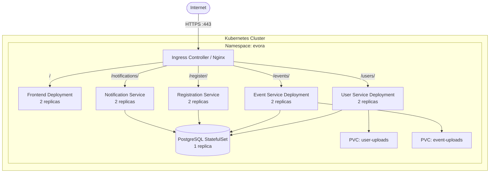

# Kubernetes Deployment Guide — Evora Platform

This guide covers how to deploy the Evora microservices platform on Kubernetes, translating the existing Docker Compose setup into production-grade K8s manifests.

---

## Prerequisites

- **kubectl** configured and connected to a cluster
- **Docker registry** (Docker Hub, GHCR, or private registry)
- A running Kubernetes cluster (Minikube, Kind, EKS, GKE, AKS, or bare-metal)
- **Cert-Manager** (optional, for automated TLS certificates)

---

## Architecture on Kubernetes



---

## Step 1: Build & Push Docker Images

Before deploying to K8s, images must be pushed to a container registry.

```bash
# Set your registry (replace with your own)
export REGISTRY=docker.io/yourusername

# Build and push all images
docker build -t $REGISTRY/evora-user-service:latest ./user-service
docker build -t $REGISTRY/evora-event-service:latest ./event-service
docker build -t $REGISTRY/evora-registration-service:latest ./event-registration-service
docker build -t $REGISTRY/evora-notification-service:latest ./notification-service
docker build -t $REGISTRY/evora-frontend:latest -f ./frontend/Dockerfile.prod ./frontend

docker push $REGISTRY/evora-user-service:latest
docker push $REGISTRY/evora-event-service:latest
docker push $REGISTRY/evora-registration-service:latest
docker push $REGISTRY/evora-notification-service:latest
docker push $REGISTRY/evora-frontend:latest
```

---

## Step 2: Create Namespace & Secrets

```bash
# Create namespace
kubectl create namespace evora

# Create secrets (replace values)
kubectl create secret generic evora-db-credentials \
  --namespace evora \
  --from-literal=POSTGRES_USER=db_admin \
  --from-literal=POSTGRES_PASSWORD=your_strong_password \
  --from-literal=POSTGRES_DB=evoradb

kubectl create secret generic evora-app-secrets \
  --namespace evora \
  --from-literal=SECRET_KEY=your_production_jwt_secret_key

# (Optional) Create TLS secret for Ingress
kubectl create secret tls evora-tls \
  --namespace evora \
  --cert=nginx/ssl/evora.crt \
  --key=nginx/ssl/evora.key
```

---

## Step 3: Deploy Manifests

Apply manifests in order:

```bash
cd k8s/

# 1. Storage & Database
kubectl apply -f namespace.yaml
kubectl apply -f postgres-pvc.yaml
kubectl apply -f postgres-statefulset.yaml
kubectl apply -f postgres-service.yaml

# Wait for PostgreSQL to be ready
kubectl wait --for=condition=ready pod -l app=postgres -n evora --timeout=120s

# 2. Backend Services
kubectl apply -f user-service.yaml
kubectl apply -f event-service.yaml
kubectl apply -f registration-service.yaml
kubectl apply -f notification-service.yaml

# 3. Frontend
kubectl apply -f frontend.yaml

# 4. Ingress
kubectl apply -f ingress.yaml

# Verify
kubectl get pods -n evora
kubectl get svc -n evora
kubectl get ingress -n evora
```

---

## Step 4: Run Database Migrations

After pods are running, apply Alembic migrations:

```bash
# Get pod names
USER_POD=$(kubectl get pod -n evora -l app=user-service -o jsonpath='{.items[0].metadata.name}')
EVENT_POD=$(kubectl get pod -n evora -l app=event-service -o jsonpath='{.items[0].metadata.name}')
REG_POD=$(kubectl get pod -n evora -l app=registration-service -o jsonpath='{.items[0].metadata.name}')
NOTIF_POD=$(kubectl get pod -n evora -l app=notification-service -o jsonpath='{.items[0].metadata.name}')

# Run migrations
kubectl exec -n evora $USER_POD -- alembic upgrade head
kubectl exec -n evora $EVENT_POD -- alembic upgrade head
kubectl exec -n evora $REG_POD -- alembic upgrade head
kubectl exec -n evora $NOTIF_POD -- alembic upgrade head
```

---

## Step 5: Verify Deployment

```bash
# Check all pods are running
kubectl get pods -n evora -w

# Check services
kubectl get svc -n evora

# Check Ingress
kubectl get ingress -n evora

# Test endpoints
kubectl port-forward -n evora svc/user-service 8000:8000
curl http://localhost:8000/docs

# View logs
kubectl logs -n evora -l app=event-service --tail=50
```

---

## Manifest Files Reference

All manifests are in the `k8s/` directory:

| File | Resource | Description |
|------|----------|-------------|
| `namespace.yaml` | Namespace | `evora` namespace |
| `postgres-pvc.yaml` | PVC | 10Gi persistent storage for PostgreSQL |
| `postgres-statefulset.yaml` | StatefulSet + Service | PostgreSQL 18 (single replica) |
| `postgres-service.yaml` | Service (ClusterIP) | Internal DB access at `postgres-db:5432` |
| `user-service.yaml` | Deployment + Service | User service (2 replicas) + upload PVC |
| `event-service.yaml` | Deployment + Service | Event service (2 replicas) + upload PVC |
| `registration-service.yaml` | Deployment + Service | Registration service (2 replicas) |
| `notification-service.yaml` | Deployment + Service | Notification service (2 replicas) |
| `frontend.yaml` | Deployment + Service | React frontend (2 replicas) |
| `ingress.yaml` | Ingress | Path-based routing + TLS |

---

## Scaling

```bash
# Scale a service
kubectl scale deployment user-service --replicas=3 -n evora

# Auto-scale based on CPU (requires metrics-server)
kubectl autoscale deployment event-service \
  --min=2 --max=5 --cpu-percent=70 -n evora
```

---

## Production Checklist

- [ ] Replace self-signed TLS certs with real certificates (Let's Encrypt / Cert-Manager)
- [ ] Use a managed PostgreSQL (AWS RDS, Cloud SQL) instead of in-cluster StatefulSet
- [ ] Configure resource requests/limits for all pods
- [ ] Set up Horizontal Pod Autoscaler (HPA) for backend services
- [ ] Move file uploads to S3-compatible object storage (MinIO, AWS S3)
- [ ] Add health check endpoints (`/health`) for liveness/readiness probes
- [ ] Set up centralized logging (EFK stack or CloudWatch)
- [ ] Configure network policies to restrict inter-pod traffic
- [ ] Use `imagePullPolicy: Always` with tagged versions (not `:latest`)
- [ ] Set `SECRET_KEY` via Kubernetes Secret, never in plain text
